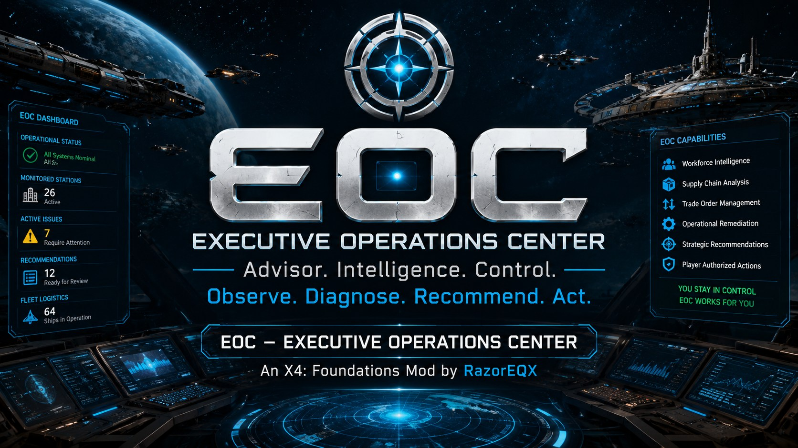

# EOC - Executive Operations Center

EOC is an intelligent empire-management advisor for **X4: Foundations**. It observes player stations, develops evidence across repeated observations, diagnoses operational problems, recommends corrective action, teaches the player how to respond, and can perform selected actions only under player-controlled authorization modes.

## Current release

**Version 1.4 GA**  
**Supported game versions:** X4: Foundations 8.0 and 9.0  
**Author:** RazorEQX  
**Steam Workshop:** [EOC - Executive Operations Center](https://steamcommunity.com/sharedfiles/filedetails/?id=3778882957)

> EOC checks optional game constants before using them so the same release can initialize safely on X4 8.0 and 9.0.

## What EOC does

- Monitors player stations and preserves long-term station intelligence.
- Lets the player classify every station by operational role.
- Can assign evidence-based roles to undefined stations immediately or after three observation cycles; every role remains manually editable.
- Provides an Executive Intelligence Dashboard with empire health, operational KPIs, trends, and change summaries.
- Adds a native-style Lua Operations Console with persistent Stations, Dashboard, and Global Settings navigation.
- Combines station roles, operational controls, and station reports in one synchronized station workspace.
- Identifies critical cases, warnings, and stations requiring action.
- Produces empire, station, and operational-remediation reports in the X4 Tips log.
- Diagnoses repeated shortages, overflow, workforce problems, station-health decline, logistics gaps, and related blockers.
- Generates evidence-based recommendations instead of reacting to a single snapshot.
- Can manage supported buy and sell offers when the player enables managed trade orders.
- Can recommend station ship assignments and operate in disabled, approval-required, or registered-ship auto-assignment modes.
- Provides ticker feedback for analysis, reports, changes, assignments, and verification.

## Player control and safety

EOC separates advice from execution.

- **Instructions only:** EOC diagnoses and explains without changing the game state.
- **Approval required:** EOC shows the exact ship, station, and role before assignment.
- **Auto-assign registered ships:** EOC may use only registered, supported candidates for verified station needs.
- **Managed trade orders:** A separate opt-in control that can be disabled later.

EOC does not buy ships, blueprints, variants, or equipment. It does not intentionally take drones, units, XS craft, the player's current ship, mission-controlled ships, already assigned ships, or unsupported candidates.

## Installation

### Steam Workshop

1. Subscribe on the [Steam Workshop page](https://steamcommunity.com/sharedfiles/filedetails/?id=3778882957).
2. Allow Steam to download the item.
3. Start X4 and confirm EOC is enabled under Extensions.
4. Load a save and confirm the EOC startup entry in **Player Information > Logbook > Ticker**.

### Manual installation

1. Download or clone this repository.
2. Copy `JK_Station_Manager` into the X4 `extensions` directory.
3. Ensure `content.xml` is directly inside `extensions/JK_Station_Manager`.
4. Restart X4 and enable the extension.

## First-time setup

1. Load the game and confirm the EOC 1.4 GA startup ticker entry.
2. Press **Control + H** to open EOC.
3. Choose **Operations Console** for the Lua interface, or continue with the original EOC pinwheel.
4. Open **Stations** and classify every player station by operational role.
5. Run **Analyze Now** and wait for the completion ticker entry.
6. Generate the **Empire Executive Report** and read it under **Player Information > Logbook > Tips**.
7. Review Critical cases first, followed by Warnings and Stations Requiring Action.
8. Leave automation disabled until the reports and recommendations make sense to you, then enable one managed capability at a time.

## User manual

The illustrated 15-page manual covers installation, every primary menu, station roles, analysis, reports, remediation, managed trade orders, shipping-control modes, ship assignment, verification, and troubleshooting.

**[Download the illustrated EOC New User Guide (PDF)](docs/EOC_1.0_GA_New_User_Guide.pdf)**

The guide documents the core EOC workflow. New 1.4 capabilities are summarized in the current release notes.

## Repository layout

- `JK_Station_Manager/` - clean runtime extension files required by X4.
- `docs/EOC_1.0_GA_New_User_Guide.pdf` - illustrated user manual.
- `docs/RELEASE_NOTES_1.4_GA.md` - current GA release summary and known boundaries.
- `docs/images/` - public documentation artwork.

Internal test plans, debug snapshots, engineering handoffs, and development archives are intentionally excluded from the public GA repository.

## Reporting a problem

When reporting an EOC issue, include:

- X4 version and hotfix number.
- EOC version shown in the startup ticker.
- The exact menu action or game event that preceded the issue.
- A screenshot of the player-facing result.
- The relevant X4 debug log when available.

Please separate EOC errors from unrelated third-party mod errors whenever possible.

## License

This repository is licensed under the [MIT License](LICENSE).

