# EOC 3.9 Player Guide — Build 383

**Current edition:** EOC 3.9, Build 383, extension version 483. The retained illustrated workflows below document Build 382.

**New optional automatic manager:** Read the [Build 383 companion guide](EOC_AUTOMATIC_MANAGER.md) for enabling background management, Diagnostics B007 requirements, spending limits, reports and stopping. Assisted play remains unchanged. End-to-end automatic outcomes remain **RUNTIME ACCEPTANCE REQUIRED**; older screenshots are not evidence of the new manager's runtime acceptance.

This edition includes new Home and money-view screenshots supplied during live use. Screenshots labeled Build 369 remain historical illustrations of retained tools; they are not relabeled as current screenshots. The established guide URL is retained for existing links.

**Game:** X4: Foundations 8.x / 9.x

EOC turns empire data into three practical answers:

1. What needs attention?
2. What should I do next?
3. Is EOC advising me, waiting for approval, or allowed to act?

The interface is organized around player tasks. The main tabs are **HOME**, **STATIONS**, **PLANS**, **HISTORY**, **SETTINGS**, and **ALL TOOLS**. Specialist tools still exist under **ALL TOOLS**.

---

## 1. Important rules

- A displayed result is evidence or advice, not proof that X4 completed an action.
- **UNKNOWN** or **UNVERIFIED** means EOC does not have enough evidence. It does not mean zero, safe, or complete.
- A saved production scenario is an advisory snapshot. It is not construction approval and does not modify the X4 Station Build Plan.
- EOC never creates free ships, credits, cargo, resources, blueprints, modules, or stations.
- Press **TAB** after changing a number so the menu commits the value.
- Follow the steady **> NEXT:** control when a page presents a sequence.
- A button marked **opens another page**, **opens recipe list**, or **opens saved list** changes the current view. Use the displayed Back control to return without losing the retained draft.

## 2. Install and open EOC

### Steam Workshop

Subscribe, let Steam finish downloading the extension, and enable it in X4 if necessary.

### Manual installation

Place the `JK_Station_Manager` folder directly under `X4 Foundations/extensions`. The final path must contain:

`X4 Foundations/extensions/JK_Station_Manager/content.xml`

Do not add another folder layer.

### Open the menu

1. Load a save and allow roughly ten seconds for initialization.
2. Open the normal **Ship Interactions** menu.
3. Select **OPEN EXECUTIVE OPERATIONS CENTER**.

EOC includes its own Dock Interactions access route; a separate UI framework is not required.

---

## 3. HOME: choose the question you want answered

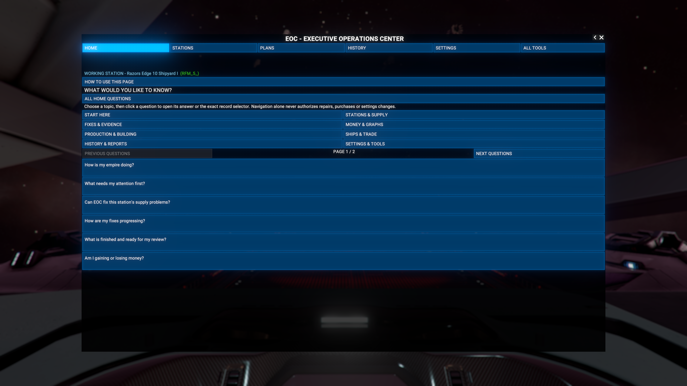

Choose a topic, then click a question to open its answer or the appropriate station/record selector. Topics are **START HERE**, **STATIONS & SUPPLY**, **FIXES & EVIDENCE**, **MONEY & GRAPHS**, **PRODUCTION & BUILDING**, **SHIPS & TRADE**, **HISTORY & REPORTS**, and **SETTINGS & TOOLS**. **ALL HOME QUESTIONS** returns to the full question catalogue.

Start Here includes these shortcuts:

- **How is my empire doing?** — retained empire overview and dashboard links.
- **What needs my attention first?** — the attention view.
- **Can EOC fix this station's supply problems?** — choose the station and inspect its issues.
- **How are my fixes progressing?** — retained progress.
- **What is finished and ready for my review?** — completed work needing review.
- **Am I gaining or losing money?** — money views.
- **How can I produce more?** — planning.
- **Where can I find every EOC tool?** — All Tools.

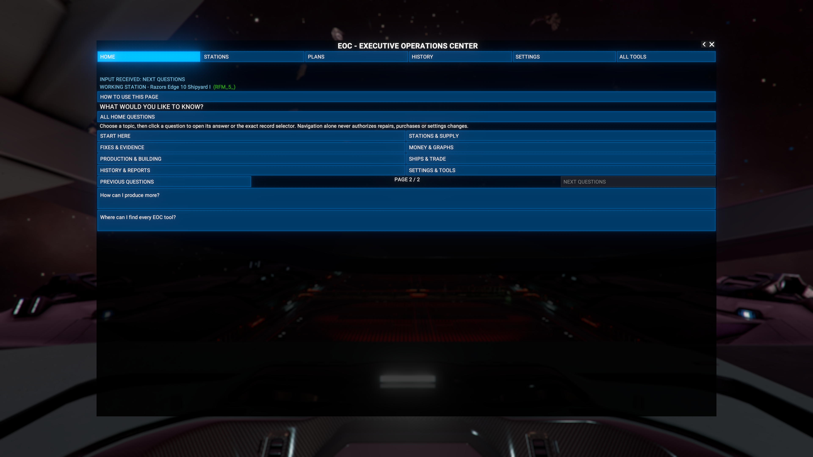

These screenshots show the Home layout introduced in Build 381 and retained in 382. Use **NEXT QUESTIONS** and **PREVIOUS QUESTIONS** when a topic spans pages. Page capacity is bounded to fit the menu.

**Back to Home Page** sits beside **HOW TO USE THIS PAGE** throughout the main menus. Returning Home changes navigation, not your jobs or shipping permissions. Opening a question or choosing a station does not authorize a repair or purchase.

The overview uses retained information. An empty or healthy-looking view is not proof of a fresh empire scan; explicitly request Supply analysis when needed.

---

## 4. STATIONS: choose and understand a station

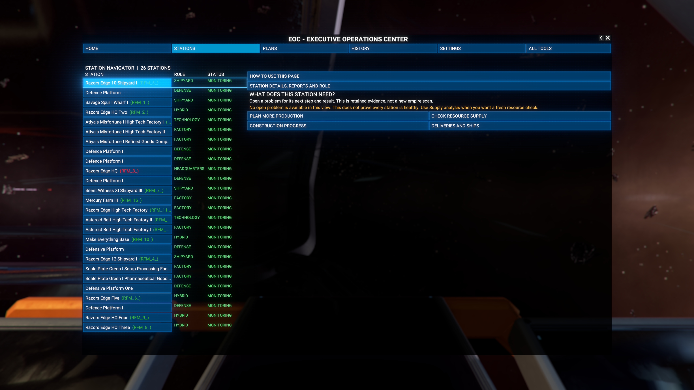

The left navigator lists each owned station, its assigned role, and current monitoring state. Select a station by its name, then use the right side for the task you want.

### Station details, reports, and role

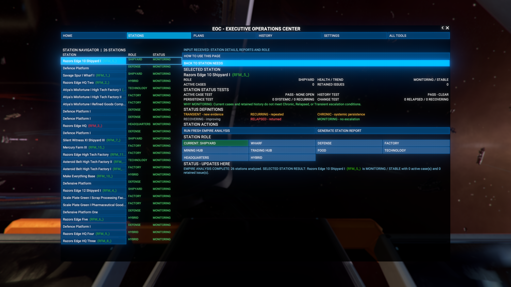

This view explains:

- the selected station and its persistent EOC role;
- active cases and retained issues;
- the health/trend classification and why EOC selected it;
- status definitions;
- explicit actions to run a fresh empire analysis or generate a station report.

Changing the EOC role changes how EOC interprets the station. It does not rebuild or reconfigure the station.

The four task shortcuts—**PLAN MORE PRODUCTION**, **CHECK RESOURCE SUPPLY**, **CONSTRUCTION PROGRESS**, and **DELIVERIES AND SHIPS**—carry the selected station into the appropriate workflow.

---

## 5. PLANS: model additional production

The Build 369 production calculator answers: “If I want to add this production here, what would the scenario require?” It is separate from evidence-backed repair plans.

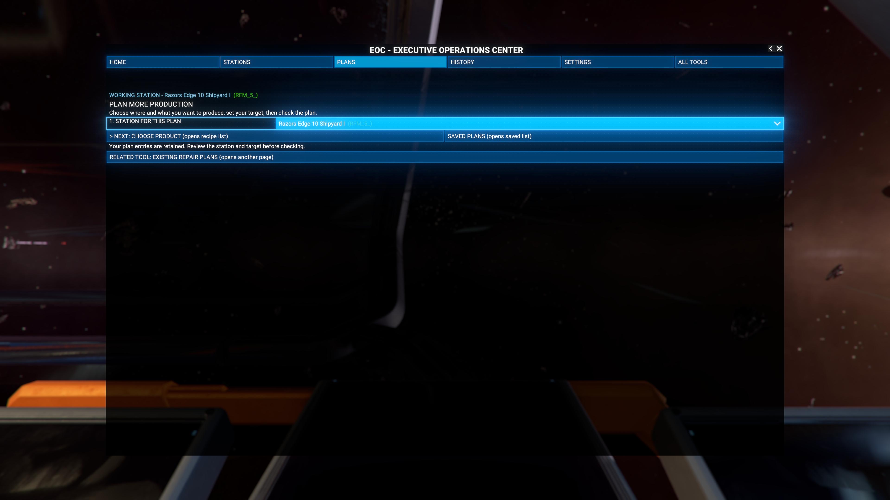

### Step 1: choose the station

Open the station dropdown on the Plans page and choose the target station.

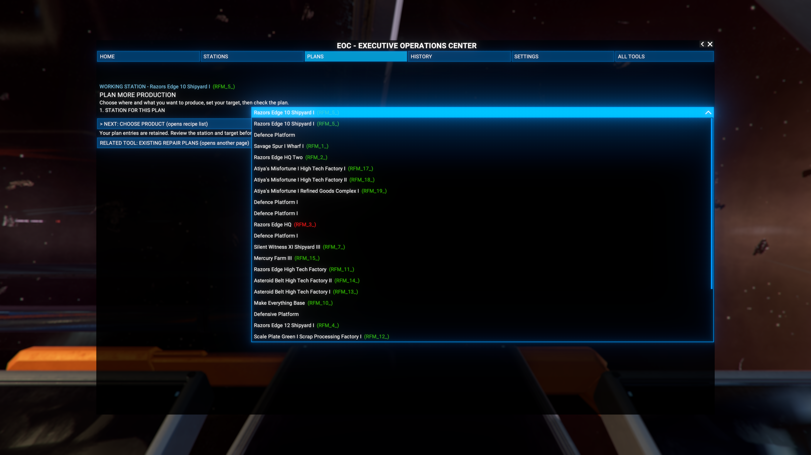

You do not need to return to the Stations tab. Changing stations preserves the reusable draft choices but invalidates a calculated result tied to the previous station. Check the scenario again after switching.

### Step 2: choose an owned production recipe

Select **> NEXT: CHOOSE PRODUCT** or **CHANGE PRODUCT**.

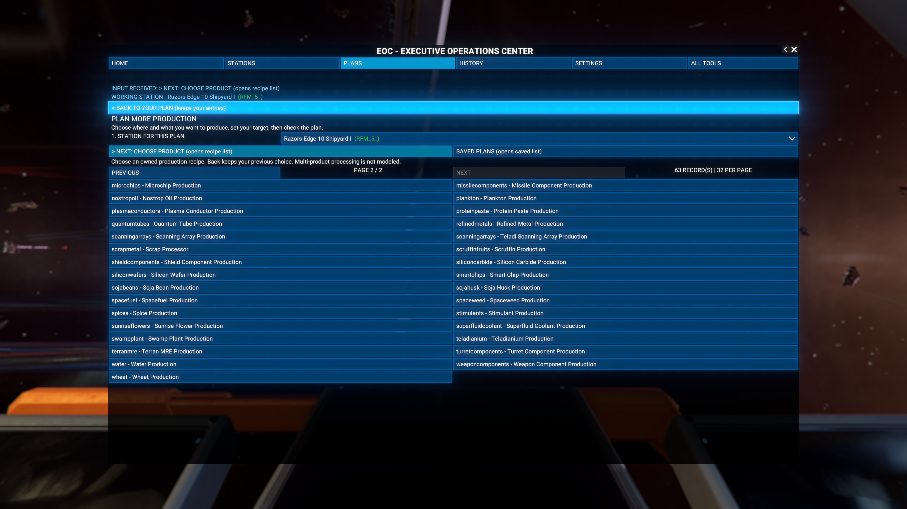

The recipe catalog is presented in two columns with bounded pages. Choose the exact ware/recipe you want to model. **< BACK TO YOUR PLAN** keeps the previous draft.

### Step 3: choose the target

The target row toggles between:

- **ADD PRODUCTION MODULES** — enter the number of modules to add.
- **UNITS PER HOUR** — enter the additional hourly output to model.

The number field changes meaning with the target. Read the label immediately above it, enter the value, and press **TAB**.

### Step 4: choose how to treat inputs

#### Supply from other stations or trade

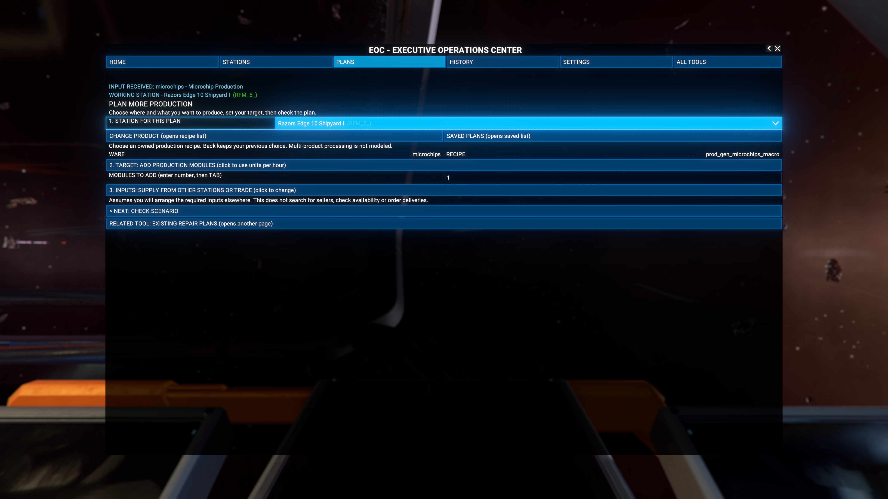

This assumes you will arrange the required inputs elsewhere. It does not search for sellers, prove availability, or order deliveries.

#### Include supporting production here

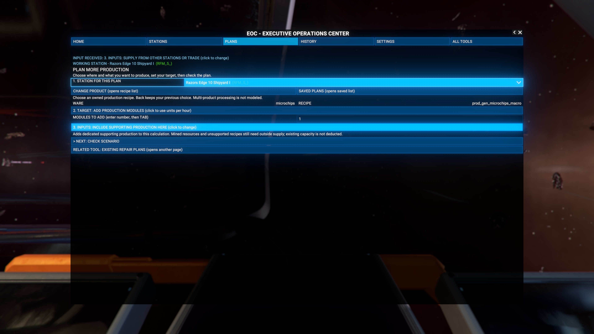

This adds dedicated upstream production to the calculation. Existing capacity is not deducted. Mined resources and unsupported recipes still require outside supply.

### Step 5: check the scenario

Select **> NEXT: CHECK SCENARIO**.

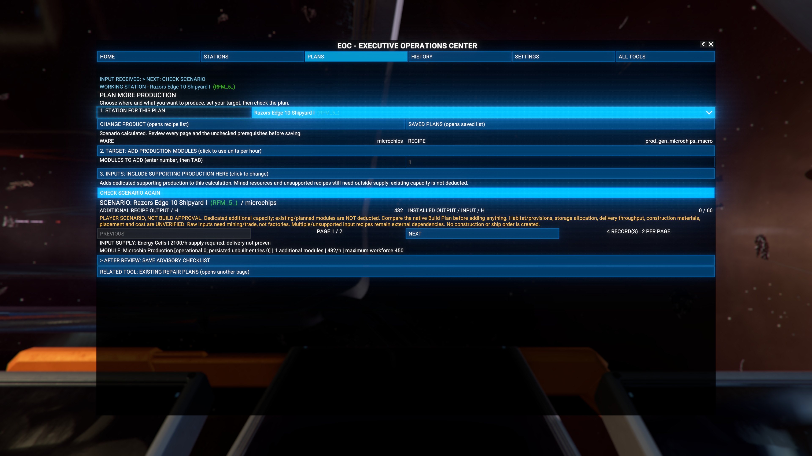

Read every result page. The summary identifies the requested output, installed evidence, required input rates, calculated module rows, workforce information where available, and unresolved boundaries.

The amber warning is important: the result is a **PLAYER SCENARIO, NOT BUILD APPROVAL**. Existing/planned modules are not deducted, and habitat/provisions, storage allocation, delivery throughput, construction materials, placement, and cost remain unverified. Raw resources still require mining or trade. Multi-product recipes remain external dependencies.

### Step 6: save the advisory checklist

After reviewing every page, select **> AFTER REVIEW: SAVE ADVISORY CHECKLIST**.

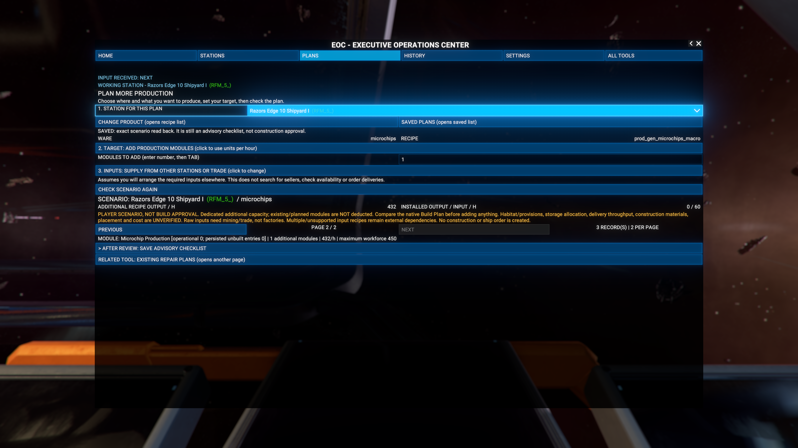

The **SAVED: exact scenario read back** message confirms that EOC persisted the scenario record. It does not mean X4 approved or started construction.

Open **SAVED PLANS** to see retained scenarios. **SHOW SAVED PLANS FOR** defaults to **All stations**; choose a station to filter the list. This is a browsing filter, not an instruction to create a production plan at every station.

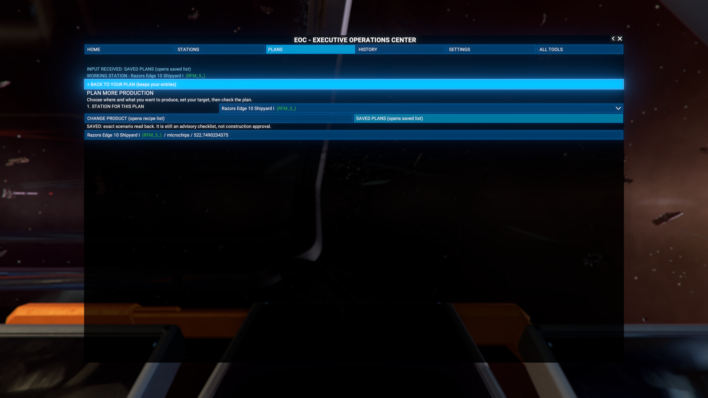

Select a saved row to reopen the exact snapshot.

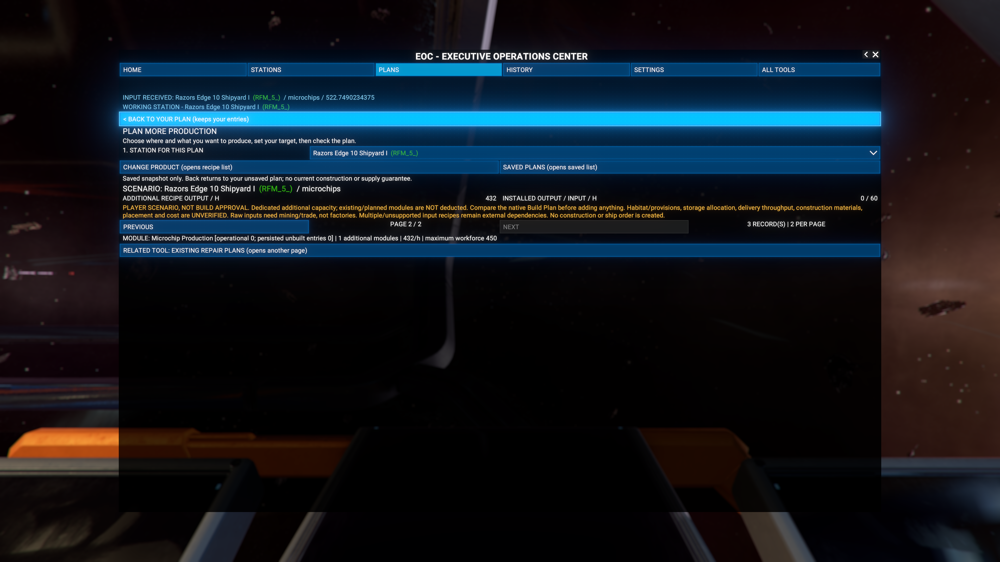

The saved detail is read-only historical advice. Use **< BACK TO YOUR PLAN** to return to the unsaved working draft. To build anything, compare the advice with X4’s native Station Build Plan and add the modules yourself.

### Existing repair plans are different

**RELATED TOOL: EXISTING REPAIR PLANS (opens another page)** leads to EOC’s recovery-gated repair planner and its saved build lists. It is not another step in the voluntary calculator.

---

## 6. CHECK RESOURCE SUPPLY

Supply analysis runs only when you explicitly request it. Opening a Supply view, changing a selector, or paging does not silently scan the empire.

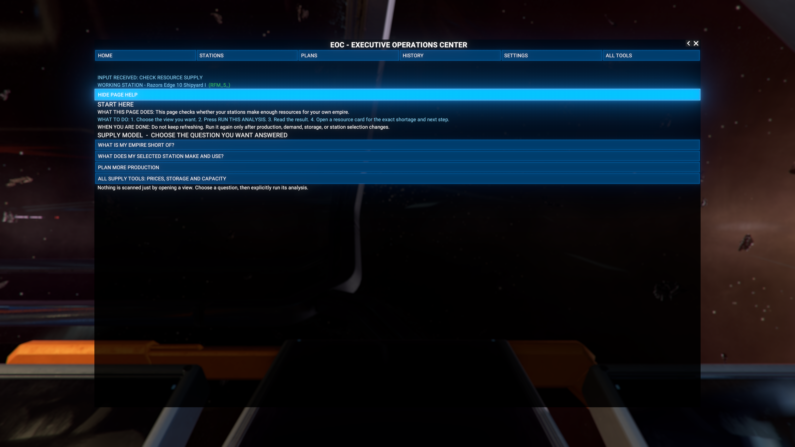

Choose the question you want answered:

- **WHAT IS MY EMPIRE SHORT OF?** compares installed player-owned capacity with measured internal station demand.
- **WHAT DOES MY SELECTED STATION MAKE AND USE?** shows a station-level supply profile.
- **PLAN MORE PRODUCTION** opens the voluntary calculator.
- **ALL SUPPLY TOOLS: PRICES, STORAGE AND CAPACITY** opens specialist views.

After entering a view, select **RUN THIS ANALYSIS** or **REFRESH THIS ANALYSIS**. Do not repeatedly refresh unless production, demand, storage, or the selected station has changed.

### Read the empire balance

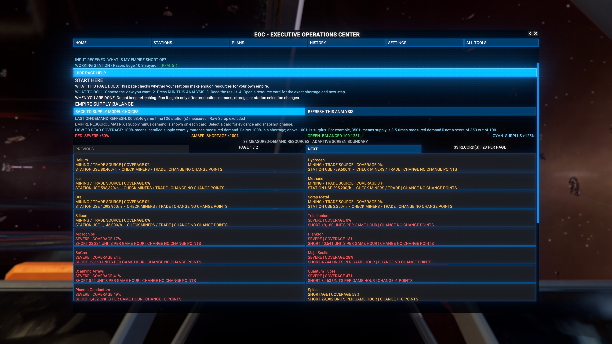

- `100%` means measured installed supply equals measured demand.
- Below `100%` means a measured shortage.
- Above `100%` means measured capacity exceeds measured demand.
- `/h` means units per game hour, not stock in storage.
- Red is severe, amber is shortage, green is balanced, and cyan is surplus.

Raw resources such as gases and minerals are labeled as mining/trade sources rather than station-production candidates.

Select a resource card for its explanation and next step.

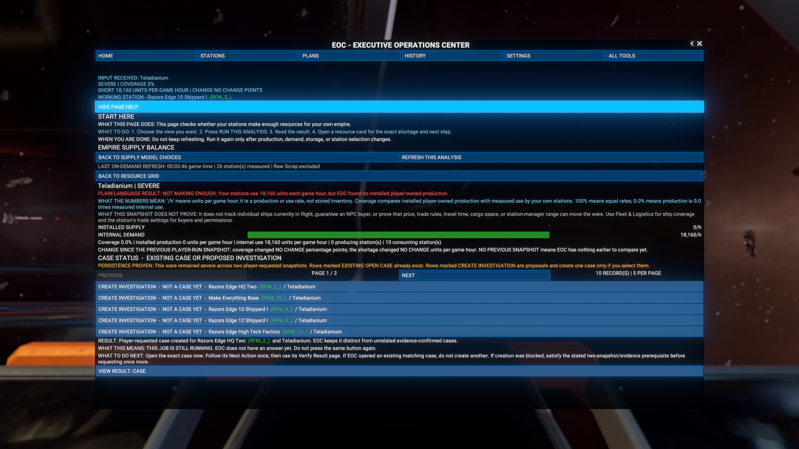

The detail states the plain-language result, what the numbers mean, what the snapshot does not prove, and whether evidence supports opening or viewing a case. Creating an investigation is a deliberate player action; selecting a resource alone does not authorize construction, trade, or ship assignment.

---

## 7. HISTORY: read retained reports

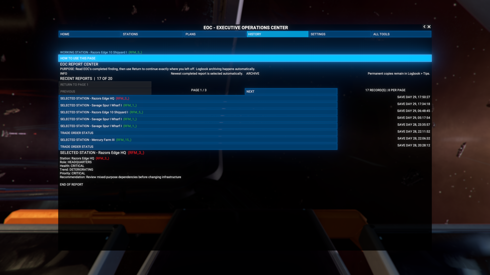

Use **REPORT LIST**, **SUMMARY**, **SUPPORTING EVIDENCE**, and **ORIGINAL REPORT** to separate the conclusion from the full recorded detail. Longer text has bounded text pages. A saved report is a historical snapshot, not a new assessment.

History lists recent EOC reports and selects the newest completed report automatically. Choose another report to read it. Reports explain the station, health, trend, priority, and current recommendation recorded at that time.

The EOC menu retains a bounded recent list. Permanent copies remain in **Player Information > Logbook > Tips**. Use a report’s Return control when available to continue from its originating workflow.

---

### Review and archive closed reports

After reading an eligible closed report, choose **REVIEWED — ARCHIVE CLOSED REPORT**. Simply opening or reading the report does not remove it. Archiving removes it from the needs-review view, not from retained history.

Use **SHOW ALL RETAINED REPORTS (INCLUDING ARCHIVED)** to find it again; **SHOW NEEDS REVIEW** returns to the review queue. Older reports without an exact closure link remain readable but cannot be safely treated as eligible closed reports. An open or still-active repair is not completed by archiving a report.

## 8. SETTINGS: define EOC’s authority

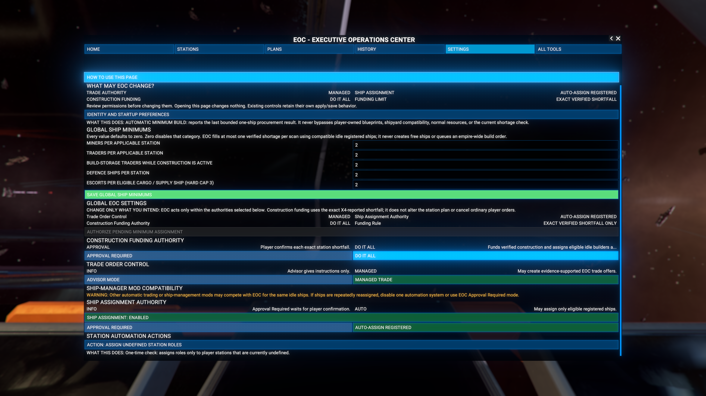

Opening Settings changes nothing. Read the scope beside every control before changing it.

### Global ship minimums

Set floors for miners, traders, construction-storage traders, defence ships, and escorts. Zero disables that category. Select **SAVE GLOBAL SHIP MINIMUMS** after editing.

EOC fills at most one verified shortage per scan using compatible idle registered ships. It never creates free ships or queues an empire-wide build order.

### Construction funding

- **APPROVAL REQUIRED** waits for confirmation of each exact verified shortfall.
- **DO IT ALL** may fund verified construction and assign eligible idle builders within that authority.

Neither mode creates or changes the station plan.

### Trade order control

- **ADVISOR MODE** provides instructions only.
- **MANAGED TRADE** may create evidence-supported EOC-owned offers.

### Ship assignment authority

- **APPROVAL REQUIRED** waits for player confirmation.
- **AUTO-ASSIGN REGISTERED** may assign only eligible ships already registered with EOC.

Other ship-management or trading mods can compete for the same ships. If assignments repeatedly change, disable one automation system or keep EOC in Approval Required mode.

---

## 9. ALL TOOLS: nothing was removed

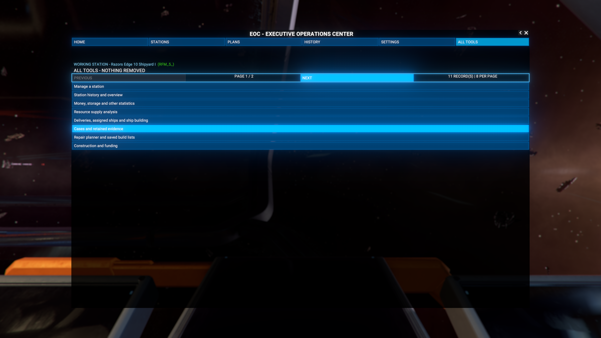

All Tools exposes the specialist workflows behind the simplified top navigation:

1. Manage a station
2. Station history and overview
3. Money, storage and other statistics
4. Resource supply analysis
5. Deliveries, assigned ships and ship building
6. Cases and retained evidence
7. Repair planner and saved build lists
8. Construction and funding
9. Reports
10. Permissions and preferences
11. Problem diagnosis and verification

Use **NEXT** for the second page of the list.

---

## 10. DELIVERIES, ASSIGNED SHIPS AND SHIP BUILDING

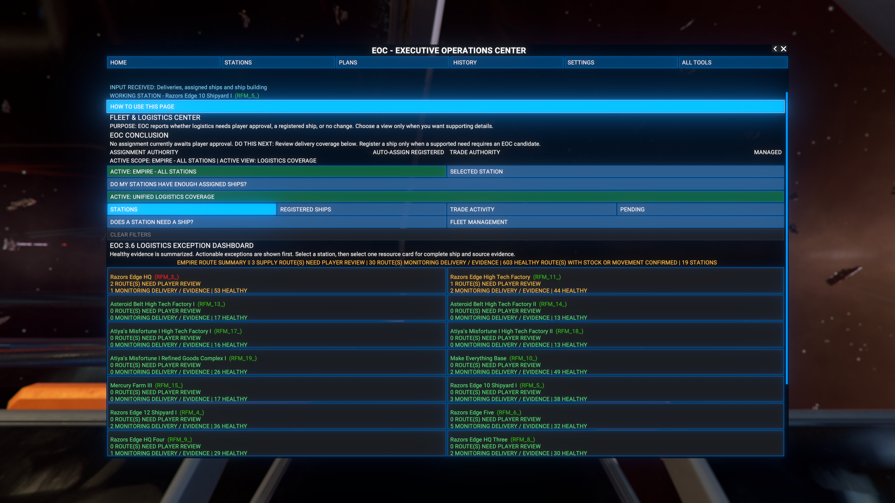

The Fleet & Logistics Center separates station coverage, registered ships, observed trade activity, pending work, and fleet management. Its conclusion tells you whether player approval, an eligible registered ship, or no change is currently required.

Select **FLEET MANAGEMENT** to open saved fleet-production templates.

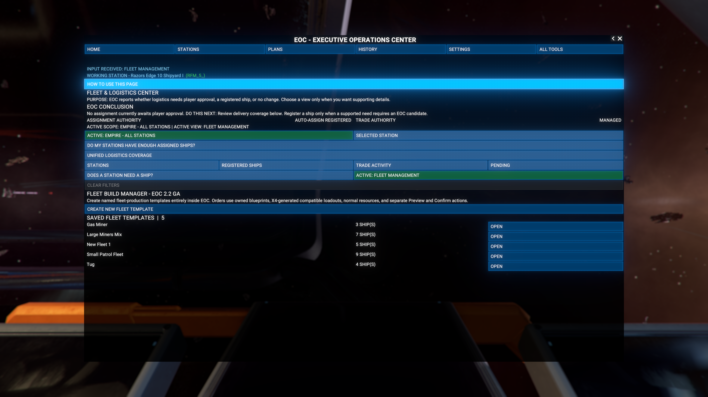

Saved templates define requested fleets; they do not bypass player-owned blueprints, compatible shipyards, normal resources, preview, or confirmation.

Select **CREATE NEW FLEET TEMPLATE** to name a fleet and add ships from owned blueprints.

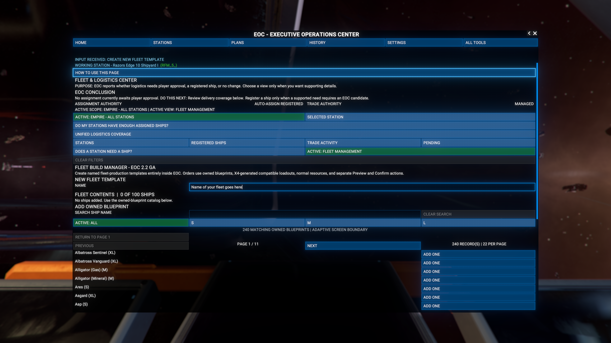

Use the size filters or name search, then select **ADD ONE** beside a blueprint. Review the completed template and the separate preview/confirm steps before issuing an order. Submission is not proof that a ship was built or delivered.

---

## 11. Cases, diagnosis, repair, and construction

These specialist tools remain under **ALL TOOLS**.

### Fix every open issue at one station

From **HOME → FIXES & EVIDENCE**, choose **How do I fix all open issues for one station?**, then select the station. You can also reach its issue list through Stations and the delivery/supply-problem controls.

1. Choose **FIX ALL OPEN ISSUES — THIS STATION (ALL PAGES)**.
2. Review the station and batch preview. It covers eligible open issues across all pages, not just the visible rows.
3. Select **CONFIRM THIS STATION BATCH** once.
4. Use **SHOW / REFRESH BATCH ITEMS** to inspect progress and individual outcomes.

Submission is bounded: at most 128 issues, one submission per five seconds subject to available investigation capacity, and a 30-minute submission window. Game time must advance. Existing work is preserved rather than restarted. Shipping permissions, ownership and ship eligibility still apply.

A disabled Fix All button can mean a station batch is already running; read the displayed reason and review its status. **Processed**, **submitted**, **preserved**, and **skipped** describe batch handling, not successful delivery. Follow the individual route's evidence to see what actually happened. For one issue, use **FIX THIS** or **CONTINUE FIX**.

### Follow a recovery job

Read the route's summary, supporting evidence and retained progress. **CHECK PROGRESS** requests the supported reassessment; **SHOW SHIP ON MAP**, when available, opens the native map for that job's ship. Awaiting delivery, observed transfer and recovered stock are different outcomes. Do not repeat a request merely because a ship is still travelling.

### Cases and retained evidence

A case keeps an exact station/subject problem, its evidence, responsibility, and next action together. Open an existing case instead of creating a duplicate. A first Supply snapshot does not prove persistence; EOC requires retained evidence before it can support stronger conclusions.

### Problem diagnosis and verification

Request verification once, follow the displayed inspection or correction, and wait for the retained result. Do not repeat the same request while it is checking or waiting. **UNCHANGED**, **IMPROVING**, **WORSENING**, **BLOCKED**, and **TEST COMPLETE** describe evidence states, not player intent.

### Repair planner and saved build lists

The repair planner is evidence-backed and recovery-gated. Immediate trade, funding, delivery, or assignment options are considered before permanent expansion. Saved repair lists track an agreed response to an exact case; they are separate from voluntary Plans scenarios.

### Construction and funding

Construction reviews an X4 plan that already exists. Refresh it to inspect the queue, builder, required wares, budget, and progress. Funding authority covers only an exact X4-reported shortfall and never creates or edits the plan.

---

## 12. Money: compare gains and losses

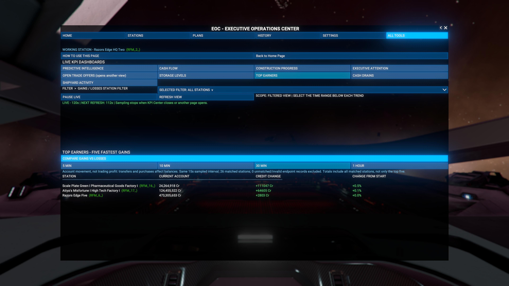

Open **HOME → MONEY & GRAPHS → How do gains compare with losses?** to go directly to comparison. Alternatively, use **ALL TOOLS → Money, storage and other statistics**, then choose **TOP EARNERS** or **CASH DRAINS** in Live KPI Dashboards.

Choose **All stations** or a station in the gains/losses filter. Select **5 MIN**, **10 MIN**, **30 MIN**, or **1 HOUR**, then **COMPARE GAINS VS LOSSES**.

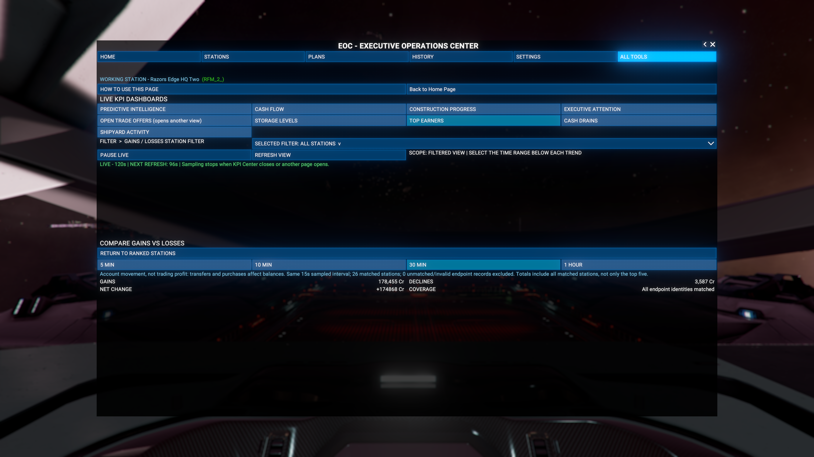

- **GAINS** totals positive account changes.
- **DECLINES** totals the magnitude of negative account changes.
- **NET CHANGE** is gains minus declines.
- **COVERAGE** identifies matched station records and excluded endpoints.

Totals include all matched stations, not just the five leaders. In this example, 178,455 Cr gained minus 3,587 Cr declined equals +174,868 Cr across 26 matched stations.

These are **account movements, not trading profit**. Purchases and transfers also change balances. Read the actual sampled interval: the screenshot has 15 seconds of history even though 30 MIN is selected. A selected window does not manufacture missing history.

Use **RETURN TO RANKED STATIONS** for the leaders list. Live sampling stops when the KPI Center closes or another page opens; use the displayed live/refresh controls to manage the current view.

---

## 13. Troubleshooting and support

### The EOC button is missing

1. Confirm EOC is enabled.
2. For manual installs, confirm the extension has no extra folder layer.
3. Load the save, wait about ten seconds, then close and reopen Ship Interactions.
4. If another mod replaces the same menu, test without that mod at your own risk. EOC cannot guarantee compatibility with another mod that replaces its access route.

### A typed number did not change

Press **TAB** or leave the field to commit it, then run the calculation or preview again.

### A Plans result disappeared after switching stations

That is intentional. Calculated results belong to the station used for the calculation. Your reusable draft choices remain, but you must check the scenario again for the newly selected station.

### Get the debug log for a report

After reproducing the problem and exiting X4 normally, locate:

`C:\Users\<Windows user>\Documents\Egosoft\X4\<numeric profile>\debuglog.txt`

Copy `debuglog.txt` before starting X4 again so the evidence is preserved. Upload the copied file to the GitHub issue with:

- EOC build/version and X4 version;
- exact steps, expected result, and observed result;
- affected station, ware, ship, or menu;
- relevant enabled mods;
- display resolution/UI scale for presentation problems;
- a screenshot of the exact EOC page.

Issues: <https://github.com/razoreqx1/JK-Empire-Operations/issues>

An `[=ERROR=]` prefix alone does not prove an EOC failure; some EOC diagnostics use X4’s error channel. Include the complete copied log so the event text and surrounding evidence can be reviewed.

---

## 14. One-page operating rule

**Choose the task → read the conclusion → follow the single NEXT action → commit edited values with TAB → preview any gameplay change → confirm only the exact scope → wait for X4 readback.**

For production scenarios, add one more rule:

**Saved advice is not construction approval. Compare it with X4’s Station Build Plan and build manually.**
