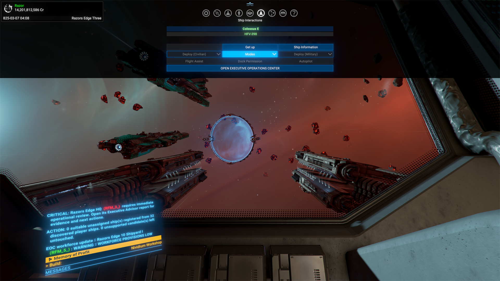
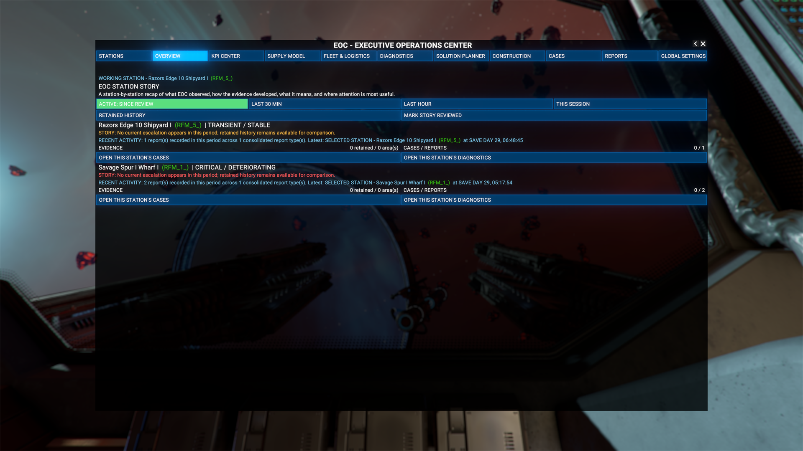
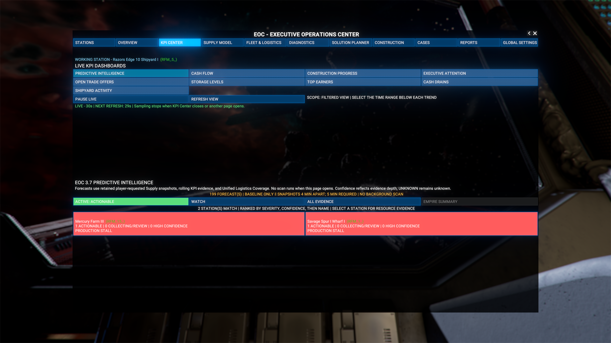
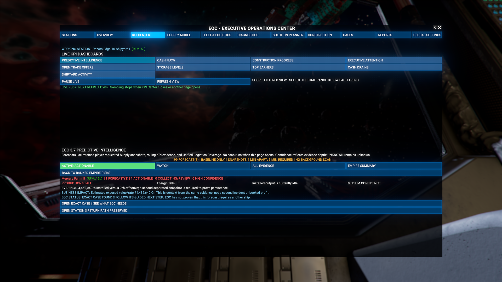
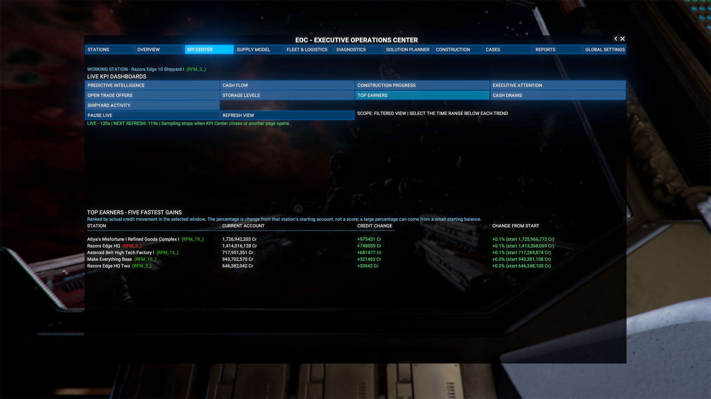
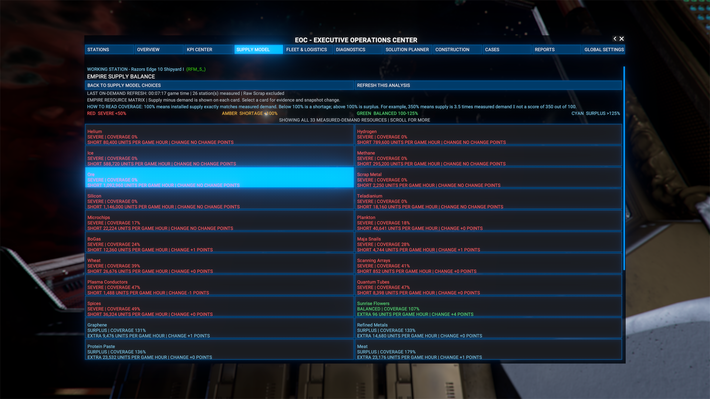
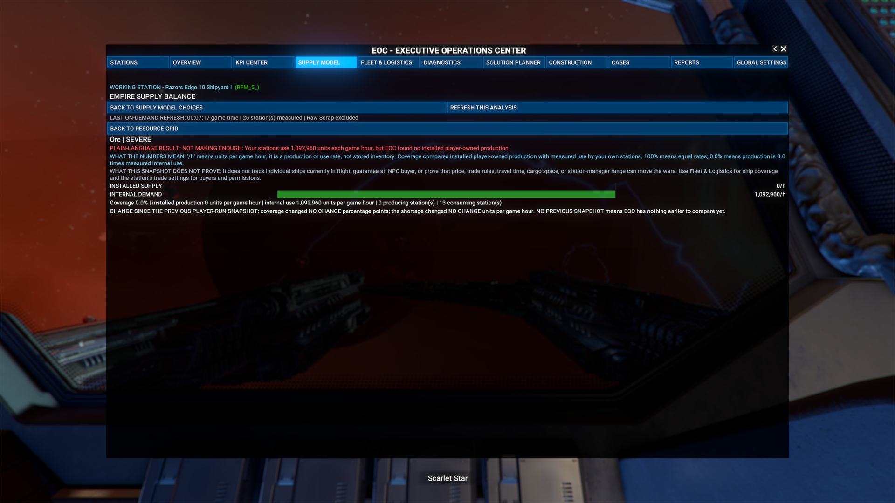
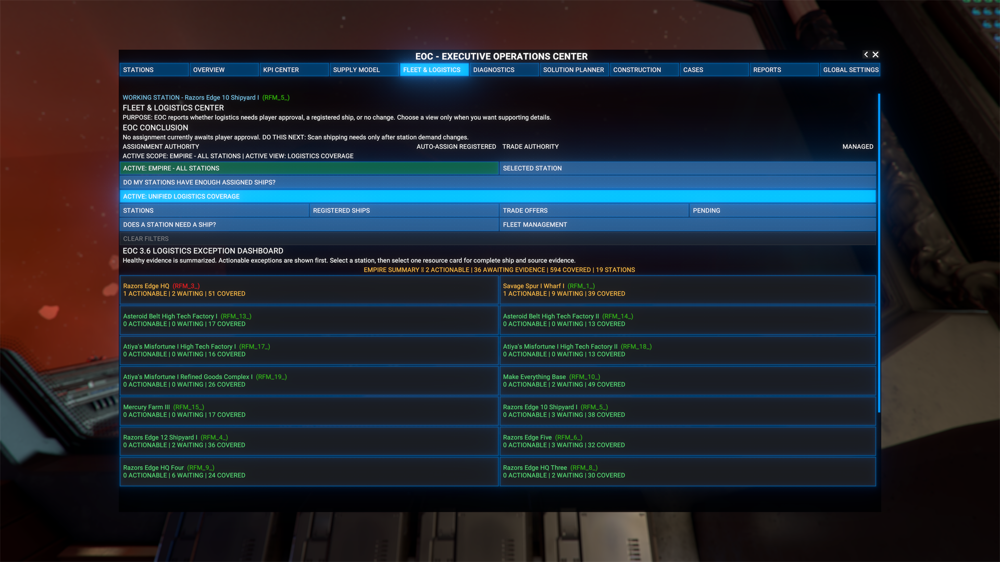
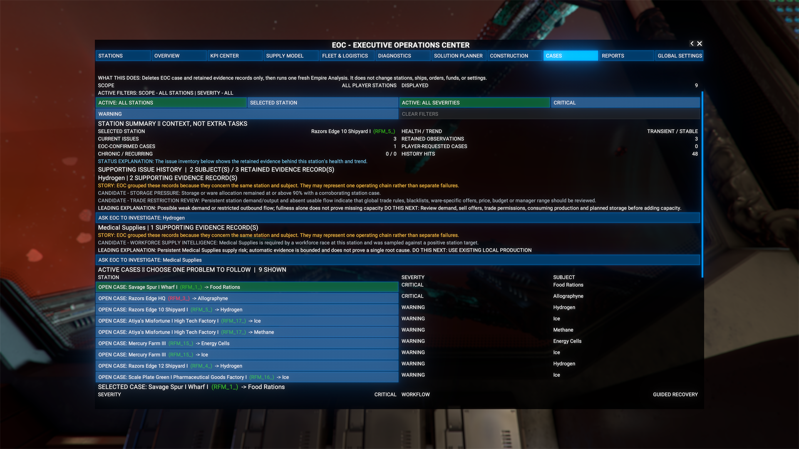

# EOC 3.9 GA Complete Player Manual

**Applies to:** EOC 3.9 GA, Build 339, extension version 4.39

**Game:** X4: Foundations 8.x / 9.x

**Purpose:** Teach a player how to operate every EOC menu, understand its conclusions, and control what it is allowed to change.

The screenshots in this manual were captured during EOC 3.9 development. Their filenames preserve the exact capture build. Build 339 retained the illustrated surfaces unless this manual explicitly explains a newer behavior.

---

## 1. What EOC is

The Executive Operations Center is an empire operations console. It turns live X4 station, supply, construction, trade, logistics, fleet, and retained case evidence into plain-language answers:

1. **What is happening?**
2. **Why does EOC believe that?**
3. **What should happen next?**
4. **Who has authority to do it: EOC or the player?**
5. **How will the result be verified?**

EOC is deliberately command-first. Start with the conclusion and the one next instruction. Open **DEEP DIVE** only when you want the supporting evidence.

### What EOC never does

- It does not create free ships, credits, cargo, resources, blueprints, modules, or stations.
- It does not silently change your station build plan.
- It does not treat missing evidence as zero or as proof that everything is safe.
- It does not claim a player click proves that the game completed an action.
- It does not ask you to run EOC's own verification test. You request the test once; EOC returns the answer.
- It does not use a per-frame scanner, permanent watcher, or countdown.
- It does not remove ordinary player or NPC trade offers. It can remove only offers it created and recorded.

### The most important word: UNKNOWN

`UNKNOWN` means EOC does not have the evidence required to support a conclusion. It does **not** mean zero, harmless, completed, or healthy. Use the next instruction shown beside the unknown result to collect the missing evidence.

---

## 2. Install, update, or remove EOC

### Steam Workshop installation

Subscribe to EOC in the Steam Workshop, allow Steam to finish downloading it, then enable the extension in X4 if it is not already enabled.

### Manual installation

Place the `JK_Station_Manager` folder directly inside the X4 `extensions` folder. The path must end like this:

`X4 Foundations/extensions/JK_Station_Manager/content.xml`

Do not add another folder between `extensions` and `JK_Station_Manager`.

### Updating

You do not need to uninstall an earlier EOC version before updating. Let Steam replace the Workshop copy, or replace the manual extension folder while X4 is closed.

### Removing

EOC adds no permanent custom ship, station, ware, sector, or other asset required to load the save. Removing the extension is not intended to make the save unloadable. Close X4 before removing a manual installation.

### Optional UI mods

EOC includes its own Dock Interactions access path. A separate UI framework is not required. Other UI extensions may remain installed for their own features.

---

## 3. Open EOC for the first time

1. Load a save.
2. Allow roughly ten seconds for initial EOC setup.
3. Open the normal **Ship Interactions** menu from the top HUD.
4. Select **OPEN EXECUTIVE OPERATIONS CENTER**.

5. On first use, choose a name for the command intelligence, or keep the default EOC identity.
6. Select **ENTER EXECUTIVE OPERATIONS CENTER**.

The optional computer loading screen is entertainment only. It does not prove that a particular scan has completed. You can turn it off later in **GLOBAL SETTINGS** without stopping EOC analysis.

---

## 4. Learn the screen before issuing commands

The header contains eleven main tabs:

1. **STATIONS** — select a station, assign its role, review its health, and control station operations.
2. **OVERVIEW** — read a time-bounded story of the empire, station by station.
3. **KPI CENTER** — view live financial, construction, trade, storage, shipyard, attention, and predictive intelligence.
4. **SUPPLY MODEL** — measure installed supply, demand, coverage, bottlenecks, producers, pricing, storage, and expansion readiness.
5. **FLEET & LOGISTICS** — review staffing, logistics coverage, registered ships, trade activity, ship recommendations, and fleet templates.
6. **DIAGNOSTICS** — ask EOC to investigate a specific case and run a background recovery test.
7. **SOLUTION PLANNER** — turn an exact case into one immediate recovery instruction and, when justified, a long-term plan.
8. **CONSTRUCTION** — inspect an existing build queue, verified funding shortfall, builder, wares, and progress.
9. **CASES** — review active EOC and player-requested investigations.
10. **REPORTS** — read completed reports and return to the page that requested them.
11. **GLOBAL SETTINGS** — set EOC identity, startup preference, ship minimums, and operational authority.

### Color language

- **Bright blue/cyan:** selected tab, navigation, or editable/dropdown control.
- **Green:** current selection, verified pass, resolved, or improving.
- **Amber:** confirmation pending, unknown, unchanged, or more evidence required.
- **Red:** failure, worsening, relapse, or an unavailable/blocked choice.
- **Gray:** available but not selected, neutral, or informational.

### Buttons that can change the game

EOC separates review from execution whenever a gameplay change is possible:

1. Select the action or enter the proposed value.
2. Read the preview and exact scope.
3. Select the explicit confirmation.
4. Wait for X4 readback. Submission is not the same as completion.

Amber normally means “you are looking at a proposal that has not been applied.”

### Lists and page controls

Long lists use bounded pages. Use the page controls at the top or bottom of the list. Opening a detail page gives you an exact return button, such as **RETURN TO RESOURCE GRID**, **RETURN TO GUIDED RECOVERY**, or **RETURN TO [ORIGIN]**.

---

## 5. Recommended first 15 minutes

This sequence gives EOC enough identity and context to become useful without granting broad authority immediately.

1. Open **GLOBAL SETTINGS**.
2. Keep **TRADE ORDER CONTROL** on **ADVISOR MODE**.
3. Keep **SHIP ASSIGNMENT AUTHORITY** on **APPROVAL REQUIRED** or disabled.
4. Keep **CONSTRUCTION FUNDING AUTHORITY** on **APPROVAL REQUIRED**.
5. Leave all global ship minimums at zero until you understand which stations should receive ships.
6. Open **STATIONS**.
7. Select each important station and confirm its persistent EOC role. You can use **ASSIGN UNDEFINED STATION ROLES** once, then manually correct any role whose business purpose is special.
8. Select **ACTION: RUN EMPIRE ANALYSIS**.
9. Open **OVERVIEW** and read the Station Story.
10. Open **CASES** and start with the highest-severity active case.
11. Use **GUIDED NEXT ACTION**. Let EOC tell you the first useful step before changing settings or building anything.

---

## 6. STATIONS: define what each station is supposed to do

### Choose a station

1. Select **STATIONS**.
2. Use the left navigator to choose a station.
3. Read its role and current status beside its name.
4. Read the right-side station summary before changing anything.

The summary combines health, trend, active cases, retained issues, construction, assignment counts, funds, and other live evidence. A healthy-looking number does not override an active exact case.

### Assign a persistent station role

Available roles are:

- SHIPYARD
- WHARF
- DEFENSE
- FACTORY
- MINING HUB
- TRADING HUB
- FOOD
- TECHNOLOGY
- HEADQUARTERS
- HYBRID

To change a role:

1. Select the intended role once.
2. Confirm that the button turns amber and reads **CONFIRM: [ROLE]**.
3. Read the station name in the confirmation message.
4. Select **CONFIRM: [ROLE]** a second time.

The role persists until you change it. It affects how EOC interprets the station and frames recommendations; it does not rebuild the station.

To classify only stations that are still undefined, select **ACTION: ASSIGN UNDEFINED STATION ROLES**. Existing persistent roles are not changed.

### Read “What Needs Attention”

If EOC has a case, this panel shows the first one to handle and why it remains open. Select **CASES**, then **GUIDED NEXT ACTION** for the complete workflow. If no current warning or critical case requires action, EOC says to continue monitoring.

### Station operation modes

**Trade Order Mode**

- **ADVISOR:** EOC gives instructions but does not create managed offers.
- **MANAGED:** EOC may create, verify, or remove evidence-supported offers that EOC owns.

**Ship Assignment Mode**

- **DISABLED:** EOC does not assign registered ships.
- **APPROVAL REQUIRED:** EOC identifies a compatible assignment and waits for confirmation.
- **AUTO-ASSIGN REGISTERED:** EOC may assign only eligible ships already registered with EOC.

### One-time station commands

- **ACTION: REVIEW EOC TRADE ORDERS** checks only EOC-owned offers. Managed mode may create, verify, or remove them.
- **ACTION: SCAN SHIPPING NEEDS** checks logistics needs and registered ships. Auto mode may assign one compatible ship.
- **ACTION: RUN EMPIRE ANALYSIS** refreshes intelligence and recommendations. It does not grant new operating authority.

### Generate station reports

Use:

- **GENERATE REPORT: SELECTED STATION** for an executive summary of the selected station.
- **GENERATE REPORT: OPERATIONAL REMEDIATION** for current problem/recovery guidance.
- **GENERATE REPORT: TRADE ORDER STATUS** for EOC-owned trade work.

The completed report opens in **REPORTS** and is also copied to **Player Information > Logbook > Tips**.

---

## 7. OVERVIEW: read the empire as a story

The Overview is not a static scorecard. It explains how retained evidence developed for each station.

### Choose a time window

- **SINCE REVIEW** shows evidence after the last time you marked the story reviewed.
- **LAST 30 MIN** shows recent evidence.
- **LAST HOUR** widens the recent window.
- **THIS SESSION** starts at the current EOC session.
- **RETAINED HISTORY** shows retained evidence outside the recent-window filters.

Select **MARK STORY REVIEWED** when you have finished reading the current story. The **SINCE REVIEW** view then becomes a clean “what changed after I looked” list.

### Read each station card

1. Read **STORY** for the plain-language conclusion.
2. Read **LEADING EVIDENCE** for the issue with the highest current operational importance.
3. Read **OUTLOOK** to see improving, stable, or deteriorating behavior.
4. Read the retained evidence, case, and report counts.
5. Select **OPEN THIS STATION'S CASES** to manage its exact cases, or **OPEN THIS STATION'S DIAGNOSTICS** to investigate recovery.

Evidence states can include candidate, recurring, systemic, recovering, or relapsed conditions. EOC retains recovering evidence until later samples show that the recovery holds.

---

## 8. KPI CENTER: watch performance without confusing samples with proof

KPI Center collects live samples only while the KPI page is open. Moving to another page stops KPI sampling. The status line tells you whether the view is live, paused, or refreshing and shows the next page-scoped refresh.

### Common controls

1. Select a dashboard.
2. Use the blue dropdown to choose the account, station, or shipyard scope when offered.
3. Select a trend range: **5 MIN**, **10 MIN**, **30 MIN**, or **1 HOUR**.
4. Use **PAUSE LIVE** to freeze the current view for reading.
5. Use **RESUME LIVE** to continue sampling.
6. Use **REFRESH VIEW** for an immediate page refresh.

### Predictive Intelligence

Predictive Intelligence uses retained Supply snapshots plus relevant KPI and logistics evidence. Opening it does not secretly run a new Supply scan. It needs two meaningfully separated explicit Supply snapshots to describe change.

1. Choose **PREDICTIVE INTELLIGENCE**.
2. Filter to actionable, watch, or all risks when the filter is available.
3. Read the empire summary.
4. Select a station or risk card.
5. Read confidence, measured evidence, business impact, and what remains unknown.
6. Use the exact offered action: open/create the exact case, collect the missing evidence, or review and authorize a single ship recommendation.
7. Use the return button to go back to the station or ranked-risk list.

### Cash Flow

Choose **PLAYER ACCOUNT / EMPIRE** or a station account. The graph compares sampled account values across the selected window. It shows observed credit movement, not accounting profit after every possible cost.

### Construction Progress

Choose all construction stations or one station with an active queue. This view reports sampled build progress; use **CONSTRUCTION** for funding, builder, and missing-ware actions.

### Executive Attention

This is a priority queue, not a performance score. Read the station state, issue count, and reason for its position. Use its action to focus the station, open its cases or recovery, or request analysis.

### Open Trade Offers

Review the selected station or all stations. This dashboard concerns EOC-observed open trade work. Use **FLEET & LOGISTICS > TRADE ACTIVITY** or a station’s **REVIEW EOC TRADE ORDERS** command for operational detail.

### Storage Levels

Storage is ranked with the fullest station first. Below 80% is green, 80% through 89.9% is amber, and 90% or higher is red. Change is measured in percentage points between samples. A flat reading does not prove cargo cannot move.

### Top Earners and Cash Drains

These compare current station-account values and movement against the beginning of the selected sample window.

An “earner” is a station whose sampled account increased; a “drain” decreased. Transfers, construction funding, and other operational movements can affect the result, so use it as a lead for investigation rather than a final profit-and-loss statement.

### Shipyard Activity

Choose all shipyards or one yard. The dashboard observes available shipyard evidence and queued/in-progress work. Use **FLEET & LOGISTICS > FLEET MANAGEMENT** to define a build template and **CONSTRUCTION** for station-module construction, which is a different system.

---

## 9. SUPPLY MODEL: measure the production network

Supply Model is explicit and snapshot-based. Opening a view does not claim that a new analysis ran. Select **RUN THIS ANALYSIS** or **REFRESH THIS ANALYSIS** on the view you need. EOC retains the previous and current snapshots for comparison.

### Read coverage correctly

- `100%` means measured installed supply equals measured demand.
- Below `100%` means a measured shortage.
- Above `100%` means measured capacity exceeds measured demand.
- `/h` means units per game hour, not units currently in storage.

A supply snapshot does not by itself prove that a ship is in flight, an NPC buyer exists, a route is safe, prices permit trade, trade rules allow the partner, cargo space is available, or the station manager can reach the source. EOC names those unknowns instead of inventing an answer.

### Empire Supply Balance

1. Select **EMPIRE SUPPLY BALANCE**.
2. Select **RUN THIS ANALYSIS** the first time, or **REFRESH THIS ANALYSIS** later.
3. Read severity, hourly shortage/surplus, coverage, and change from the prior snapshot.
4. Select a resource card to open its detail.
5. Select **RETURN TO RESOURCE GRID** when finished.

The detail explains installed supply, internal demand, what coverage means, and what the snapshot cannot prove. If a severe condition persists long enough, the Case bridge can open the exact existing case or allow one exact station/ware case. Duplicate cases remain locked.

### Installed / Supported / Effective

Use this view to separate theoretical installed production from production supported by required inputs and the currently effective result. A large installed number with a much lower effective number points to a dependency or operating constraint rather than a need to duplicate the output module immediately.

### Top Supply Bottlenecks

Run the analysis, then read the ranked shortages. Open the exact ware to see its measured producers, consumers, coverage, and evidence limitations. Treat this as the starting list for intervention, not an automatic construction order.

### Wares by Producing Station

Choose a product, then inspect the stations that produce it. This answers “where is this ware made?” and helps distinguish empire-wide capacity from a problem at one particular station.

### Selected Station Supply Profile

1. Select the intended station.
2. Run or refresh the analysis.
3. Read each resource card.
4. Compare installed/effective output, installed input, current stock, and empire-wide context.

### Station Price & Storage Plan

This workflow changes manual price or ware-allocation overrides only after preview and confirmation.

1. Select the exact station.
2. Select the exact ware.
3. Compare **Current**, **EOC Suggested**, and **Proposed** values.
4. Enter the proposed buy price, sell price, or storage allocation.
5. Press **TAB** or leave the field so the entry commits to the preview form.
6. Select the preview command.
7. Verify the station, ware, old values, and proposed values.
8. Select the explicit confirmation to apply, or cancel.
9. Read the X4 readback.

Storage is entered in whole units, cannot exceed the supported cap, and competes with other wares for shared physical storage. Changing allocation does not create a storage module or move cargo. Price changes stay within X4’s ware range and EOC preserves a minimum buy/sell spread.

If batch preview is offered, it includes only changed buy/sell prices. It never batch-applies storage. Review every included station/ware change, then confirm all or cancel all.

### Advisory Expansion Planner

1. Select the station and ware under review.
2. Run **EXPANSION READINESS CHECK**.
3. Read the conclusion and every dependency.
4. If the result is **NOT READY**, resolve the named blockers before building.
5. If EOC says it **CANNOT PROVE** readiness, inspect the vanilla Build Plan and missing evidence.

This planner is advisory. It does not prove an exact module macro, module count, blueprint ownership, plot fit, build cost, or final layout. Use the vanilla station Build Plan for the actual design.

---

## 10. FLEET & LOGISTICS: understand ships as capacity, not just a count

Choose **EMPIRE** scope or the selected-station scope, then choose a view. Use **CLEAR FILTERS** when a prior filter hides the record you expect.

### Enough Assigned Ships

This is station staffing by assigned ships, not employees or workforce.

- **Player floor** is the minimum you configured.
- **EOC learned minimum** is an observation-only estimate of sustained operational need.
- **Assigned** is what X4 currently reports assigned to the station.

The learned capacity starts in **LEARNING**. It requires six five-minute samples. It can rise quickly under demonstrated pressure but falls only after six lower-pressure samples. Learning does not move, remove, build, or reassign a ship.

Filter to below-floor, covered, or all stations. If the floor is wrong, go to **GLOBAL SETTINGS > GLOBAL SHIP MINIMUMS**.

### Unified Logistics Coverage

This view separates:

- **ACTIONABLE** — evidence supports a specific current intervention.
- **WAITING** — EOC lacks required movement, route, ship, reservation, or throughput evidence.
- **COVERED** — current evidence supports adequate coverage.

1. Open a station card.
2. Select a resource.
3. Read stock versus target, work/wait/block state, assigned ships, eligible ships, source, and last movement.
4. If EOC requests fresh rate evidence, run the offered stock/rate collection command.
5. Follow the exact next action; do not interpret an unknown ship or route value as zero.

Ordinary station traders are a shared pool. Their existence does not prove a particular ware route is being served.

### Stations

Use this list to compare fleet/logistics state by station and open the selected station’s related evidence.

### Registered Ships

Registered ships are the pool EOC is allowed to consider for EOC ship assignments. Registration does not itself assign a ship. Review compatibility and idle state before authorizing an assignment.

### Trade Activity

Separate ordinary empire trade work from EOC-managed offers. EOC ownership matters: it may reconcile or remove only the offers it created and retained.

### Pending

Use this view to find assignments, managed work, or other fleet actions waiting for evidence or player approval. Open the exact item and read why it is pending before authorizing it.

### Need a Ship Recommendations

This command appears for an exact active case with no compatible ship available.

1. Open the recommendation from the exact case.
2. Confirm the station, job, and why no current registered ship is compatible.
3. EOC chooses an M or L candidate only when you own a suitable blueprint and a compatible player shipyard exists.
4. Preview the order for exactly one ship.
5. Confirm once, or cancel.
6. Read the submitted/skipped result.

EOC never creates a free ship. The normal player shipyard, resources, queue, and generated loadout are used. Once submitted, the duplicate recommendation is locked so repeated clicks cannot queue the same one-ship response.

Before building, consider the less expensive action: register and assign a suitable idle ship, scan shipping needs, or review an existing EOC order.

### Fleet Management: reusable build templates

To create a template:

1. Open **FLEET MANAGEMENT**.
2. Select **CREATE TEMPLATE**.
3. Enter a clear name describing the fleet’s job.
4. Search owned blueprints.
5. Filter by **ALL**, **S**, **M**, or **L** if needed.
6. Add ship types and quantities within the displayed limits.
7. Save the template.

To change or remove one, open the template, choose edit or delete, and complete the displayed confirmation.

To use a template:

1. Open the saved template.
2. Choose one compatible player shipyard, or choose to spread work across compatible player shipyards.
3. Select **PREVIEW**. Preview does not place an order.
4. Review every planned job and skipped item.
5. Select **CONFIRM BUILD** only if the preview is correct.

Normal blueprint ownership, yard compatibility, resources, queues, and loadouts apply.

---

## 11. CASES: manage exact problems without duplicates

Cases are keyed to exact evidence such as station, subject, ware, and issue family. EOC-owned operational cases and player-requested investigations remain distinct.

### Filter the list

1. Choose **ALL STATIONS** or the selected station.
2. Choose **ALL**, **CRITICAL**, or **WARNING** severity.
3. Use **CLEAR FILTERS** to restore the complete list.

### Open and act on a case

1. Select the case.
2. Read the **command summary** first.
3. Select **GUIDED NEXT ACTION**.
4. Follow the single instruction and primary action.
5. Open **DEEP DIVE** only when you want the evidence record and reasoning.
6. Use **OPEN STATION**, **GENERATE REPORT**, or the exact offered workflow when useful.

When multiple observations concern the same station and subject, the Case story groups them rather than producing a pile of duplicate investigations.

### Ask EOC to investigate something

1. Select the station and supported subject.
2. Select **ASK EOC TO INVESTIGATE**.
3. If an exact investigation already exists, EOC opens it instead of creating a duplicate.
4. A new player-requested investigation begins without pretending that a fault has already been proven.
5. Select **RUN EMPIRE ANALYSIS** when instructed.

If the fresh evidence finds no matching current problem, EOC may complete the request with that honest conclusion.

### Close a player-requested case

Use the close command on the exact player-requested investigation. Closing your request does not rewrite unrelated EOC-owned evidence.

### Clear all cases

This is an advanced reset, not ordinary cleanup.

1. Select **CLEAR ALL CASES**.
2. Read the full scope.
3. Complete the explicit confirmation only when you intend to reset cases, evidence, EOC-managed action state, checklist answers, and command requests.
4. EOC then rebuilds from fresh live data.

The reset preserves player assets and global settings. Do not use it merely because a case is inconvenient; use Guided Recovery to prove resolution.

---

## 12. DIAGNOSTICS: let EOC run the test and return the answer

Diagnostics has three views:

- **NEXT ACTION** — the conclusion, single instruction, and primary action.
- **EVIDENCE DETAILS** — what was checked, what was found, and what remains unknown.
- **VERIFY RESULT** — background test status and completed comparison.

### Start Guided Recovery

1. Open the exact case.
2. Select **GUIDED NEXT ACTION**, or open **DIAGNOSTICS** with that case active.
3. Read the root-cause conclusion and confidence.
4. Perform only the named player action, if one is required.
5. Use **DEEP DIVE** for the three-part explanation: what EOC found or cannot prove, what EOC is doing, and the long-term plan/checklist.

### Request verification once

This is the current EOC 3.9 behavior:

1. Complete the requested recovery action.
2. Select **ASK EOC TO VERIFY** once.
3. EOC stores the exact baseline for the station, subject, severity, and measured amount.
4. Leave the EOC screen or continue normal gameplay. You do not keep the page open, certify elapsed time, request another sample, or decide whether a “meaningful cycle” passed.
5. **Do not enter Station Build mode while the verification job is active.** Build mode can disrupt the evidence path used by this test.
6. EOC completes the comparison through its established bounded empire-analysis cycle.
7. EOC returns a notification, Logbook entry, and retained EOC status.
8. Wait for the explicit **TEST COMPLETE** message before entering Station Build mode.
9. Return to **DIAGNOSTICS > VERIFY RESULT** to read the result.

The established cycle is normally scheduled at five-minute intervals, but total completion time depends on when the request lands relative to the current cycle and the size of the empire. There is deliberately no per-frame watcher or countdown. The player’s proof is the returned **TEST COMPLETE** result, not elapsed wall-clock time.

Possible supported results include:

- **IMPROVING** — fresh evidence moved in the expected direction.
- **UNCHANGED** — fresh evidence did not materially change.
- **WORSENING** — fresh evidence moved in the wrong direction.
- **BLOCKED** — EOC could not obtain the required evidence and explains why.

### Optional bounded trade test

When the exact case needs market evidence, Guided Recovery may offer an external trade test:

1. Preview one EOC-owned NPC **BUY** or **SELL** offer.
2. Verify station, ware, direction, amount, and reason.
3. Confirm once, or choose to keep the solution empire-only.
4. EOC prevents a duplicate test offer.
5. If removal is later appropriate, preview and confirm removal of that exact EOC-owned offer.

EOC never removes ordinary station offers by guessing ownership.

### Storage evidence is separate

A storage-pressure case may require storage evidence rather than a trade test. Read current stock, target, allocation, total capacity, station funds, and the evidence checklist. Change price/allocation only through the Supply Model preview workflow when that is the named action.

---

## 13. SOLUTION PLANNER: choose recovery before permanent expansion

Solution Planner is case-driven. If no exact case is loaded, use **OPEN DIAGNOSTICS** and select one.

1. Read the conclusion.
2. Follow the one next instruction.
3. Use the primary action.
4. Open **DEEP DIVE** for the technical evidence and dependency chain.

The planner gates permanent construction until immediate recovery options have been exhausted. If matching production is already planned, it helps you review that plan instead of recommending a duplicate. Headquarters and mixed-purpose stations receive additional caution because their ware flows can have several valid purposes.

### Expansion readiness

Select **RUN EXPANSION READINESS CHECK**. This is read-only.

Review:

- exact station and ware
- existing local production
- already planned matching production
- reachable supply
- compatible traders
- current input gap
- module and blueprint evidence
- production method and workforce dependencies
- output and deficit evidence
- the complete input-chain checklist

**NOT READY** is a real block. **CANNOT PROVE** is not a pass; inspect the vanilla Build Plan and the named missing evidence. EOC does not authorize a module build merely because a shortage exists.

---

## 14. CONSTRUCTION: support a plan that already exists

Construction works with the exact selected station and its existing X4 build queue.

1. Select the station.
2. Open **CONSTRUCTION**.
3. Select **REFRESH CONSTRUCTION STATUS**.
4. Read queued, underway, and planned items.
5. Read the readiness checklist: queue, progress, builder, required wares, and budget.

### Funding a verified shortfall

EOC funds only the exact X4-reported construction-account shortfall. It does not change the plan or cancel ordinary orders.

- In **APPROVAL REQUIRED**, preview the exact station and shortfall, then confirm the transfer.
- In **DO IT ALL**, EOC may fund a verified shortfall automatically within that authority.
- With no active queue, funding is blocked because there is no supported construction need.

### Builder support

If the plan has no builder, EOC may identify an eligible idle builder. In approval mode, review and confirm the exact assignment. In **DO IT ALL**, eligible idle builders may be assigned automatically.

### Missing wares and progress

Read the ordered missing-ware list and queue progress. A funded account does not prove wares have arrived, and a builder assignment does not prove construction has started. Refresh status for X4 readback.

---

## 15. REPORTS: keep a readable record

Reports are generated from Stations, Overview, Cases, or other exact workflows.

1. Request a report.
2. EOC opens **REPORTS** automatically when it completes.
3. The newest report is selected.
4. Select another title from **RECENT REPORTS** to read it.
5. Use **RETURN TO [ORIGIN]** to resume exactly where you left off.

The current session keeps up to 20 recent reports in the EOC list. Permanent archive copies are written to **Player Information > Logbook > Tips**.

---

## 16. GLOBAL SETTINGS: decide what EOC may do

### Identity and startup experience

Change the command intelligence identity if desired. Toggle **COMPUTER LOADING SCREEN: ON/OFF**, then select **SAVE GLOBAL SETTINGS**. The toggle affects only the visual startup sequence; analysis and scanning continue either way.

### Global ship minimums

Available floors are:

- miners per applicable station
- traders per applicable station
- build-storage traders while construction is active
- defence ships per station
- escorts per eligible cargo/supply ship, hard-capped at 3

Every value defaults to zero; zero disables that category.

1. Enter whole-number floors.
2. Select **SAVE GLOBAL SHIP MINIMUMS**.
3. Run a shipping-needs scan when appropriate.
4. In Approval Required mode, select **AUTHORIZE PENDING MINIMUM ASSIGNMENT** only after reviewing the exact pending assignment.

EOC fills at most one verified shortage per scan and uses only compatible idle registered ships. It does not create free ships or queue an empire-wide build order.

### Construction Funding Authority

- **APPROVAL REQUIRED:** you confirm each exact station shortfall and eligible builder action.
- **DO IT ALL:** EOC may fund verified construction and assign eligible idle builders automatically.

### Trade Order Control

- **ADVISOR MODE:** instructions only.
- **MANAGED TRADE:** may create evidence-supported EOC-owned offers.

### Ship Assignment Authority

First enable or disable ship assignment, then choose:

- **APPROVAL REQUIRED** — waits for your confirmation.
- **AUTO-ASSIGN REGISTERED** — may assign only eligible registered ships.

Other automatic trade or ship-management mods may compete for the same idle ships. If ships are repeatedly reassigned, disable one automation system or keep EOC on Approval Required.

### Assign undefined station roles

**ACTION: ASSIGN UNDEFINED STATION ROLES** is a one-time empire check. It assigns roles only to player stations whose EOC role is currently undefined. It does not overwrite existing persistent roles.

---

## 17. Complete player workflows

### Workflow A: diagnose and recover a shortage

1. **SUPPLY MODEL > EMPIRE SUPPLY BALANCE > RUN THIS ANALYSIS**.
2. Open the severe ware.
3. Read coverage and unknowns.
4. Use the exact Case bridge if the persistence requirement is met.
5. **CASES > exact case > GUIDED NEXT ACTION**.
6. Follow the single immediate instruction.
7. Use **SOLUTION PLANNER** only when the case calls for longer-term review.
8. If a price/storage change is recommended, use **SUPPLY MODEL > STATION PRICE & STORAGE PLAN**, preview, then confirm.
9. Select **ASK EOC TO VERIFY** once.
10. Stay out of Station Build mode until **TEST COMPLETE**.
11. Read **DIAGNOSTICS > VERIFY RESULT**.

### Workflow B: decide whether to expand production

1. Run a fresh Supply analysis.
2. Open the exact bottleneck and case.
3. Complete immediate recovery steps first.
4. Open **SOLUTION PLANNER**.
5. Run **EXPANSION READINESS CHECK**.
6. Resolve every **NOT READY** item.
7. For **CANNOT PROVE**, verify blueprints, module, method, plot, cost, and layout in vanilla Build Plan.
8. Create or modify the plan in X4 yourself.
9. Use **CONSTRUCTION** to review funding, builder, wares, and progress.

### Workflow C: correct logistics coverage

1. **FLEET & LOGISTICS > UNIFIED LOGISTICS COVERAGE**.
2. Filter to **ACTIONABLE**.
3. Open station and resource detail.
4. Collect fresh stock/rate evidence if requested.
5. If a suitable registered ship exists, scan shipping needs and review the assignment.
6. If none exists, open the exact **NEED A SHIP** recommendation.
7. Preview and confirm at most one compatible ship build.
8. Wait for the normal shipyard to build it.
9. Register/assign it under the selected authority.
10. Re-run the exact evidence workflow and let EOC verify the outcome.

### Workflow D: safely automate routine support

1. Start with all modes on approval.
2. Confirm station roles and register only ships you are willing to let EOC use.
3. Set conservative global minimums.
4. Observe several scans and inspect every proposed assignment/offer.
5. Move ship assignment to **AUTO-ASSIGN REGISTERED** only after the eligible pool behaves as expected.
6. Move trade to **MANAGED** only after reviewing EOC-owned offer behavior.
7. Move construction to **DO IT ALL** only if you want exact verified shortfalls funded and eligible idle builders assigned without individual confirmation.
8. Return to Approval Required whenever another automation mod competes or you want closer control.

---

## 18. Status glossary

- **PASS / RESOLVED:** current evidence supports completion.
- **IMPROVING:** fresh evidence moved in the expected direction, but retained history may continue until recovery holds.
- **UNCHANGED:** the new sample did not materially change the measured condition.
- **WORSENING / RELAPSED:** evidence deteriorated or a previously improving condition returned.
- **UNKNOWN:** required evidence is absent.
- **MORE OBSERVATION REQUIRED:** EOC has evidence, but not enough separated samples to support the stronger conclusion.
- **CANDIDATE:** an early signal exists but has not met recurrence/persistence requirements.
- **RECURRING:** the condition has repeated.
- **SYSTEMIC:** retained evidence supports a broader persistent problem.
- **RECOVERING:** evidence improved, but EOC is waiting to prove that it holds.
- **BLOCKED:** EOC cannot complete the exact step and names the obstacle.
- **ACTIONABLE:** the current evidence supports a specific action now.
- **WAITING:** an external game event or missing evidence prevents a supported action now.
- **COVERED:** evidence supports adequate current coverage.
- **LEARNING:** fleet-capacity history has not yet reached the required sample confidence.
- **TEST COMPLETE:** the background verification has returned a supported result; the temporary Station Build mode restriction is released.

---

## 19. Troubleshooting

### EOC does not appear in Ship Interactions

1. Confirm the extension is enabled.
2. For a manual install, confirm `extensions/JK_Station_Manager/content.xml` exists without an extra folder layer.
3. Load the save and wait about ten seconds.
4. Close and reopen Ship Interactions.
5. If another UI mod changes the same menu, test with that mod disabled and report the conflict.

### A value did not change after typing it

Press **TAB** or leave the field to commit the edit to the form, then preview. Typing alone does not apply a game change.

### EOC says UNKNOWN

Read the next instruction. Run the named explicit analysis, evidence collection, shipping scan, construction refresh, or background verification. Do not substitute a guess.

### Verification seems to take a long time

Do not request it again. The job is retained. Stay out of Station Build mode until EOC returns **TEST COMPLETE**. The normal five-minute schedule is not a promise of a five-minute answer because the request can land between cycles and empire size affects completion.

### A case returns after improving

Read its retained evidence. Recovery can remain in observation until later samples prove stability; a relapse means the measured condition returned.

### Ships keep being reassigned

Another automation system may be competing with EOC. Disable one ship-management automation or switch EOC to **APPROVAL REQUIRED**.

### Managed trade changed something I did not expect

Open Trade Activity and review EOC-owned offers. EOC identifies its own offers separately. Include a fresh debug log in a support report if ownership or removal appears wrong.

### Report a reproducible problem

Include:

- EOC version and engineering build
- X4 version
- station and ware/subject
- exact steps
- expected and observed result
- other relevant mods
- a fresh X4 debug log covering the reproduction
- a screenshot of the exact EOC page when useful

Report issues at: https://github.com/razoreqx1/JK-Empire-Operations/issues

---

## 20. One-page operating rule

When EOC raises a problem, follow this order:

**Read the conclusion → follow the single next instruction → preview any gameplay change → confirm only the exact scope → ask EOC to verify once → stay out of Station Build mode while that job runs → wait for TEST COMPLETE → read the returned result.**

That is the difference between using EOC as a dashboard and using it as an operations center.
